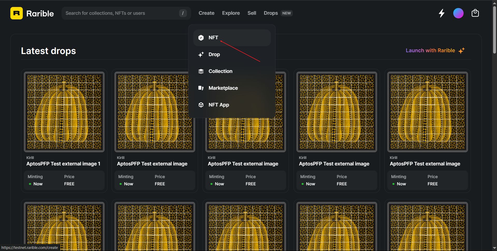
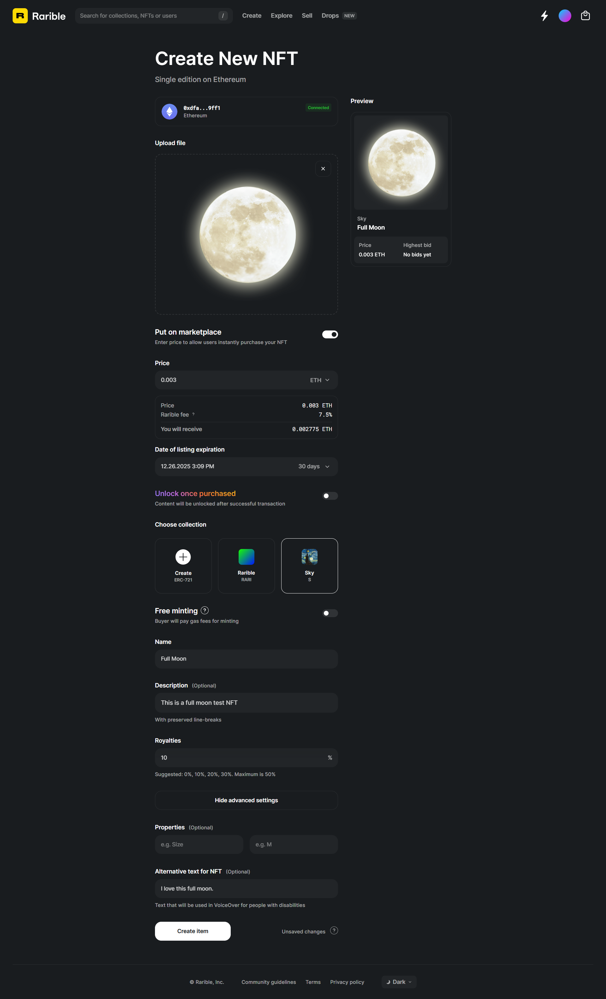
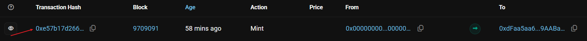
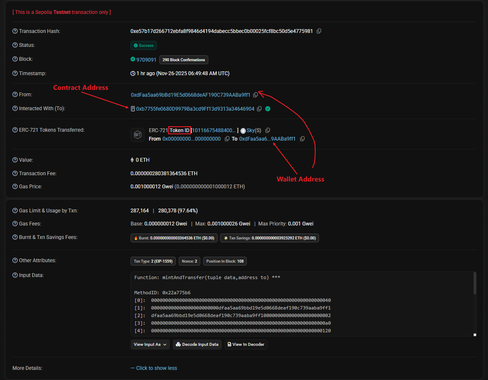
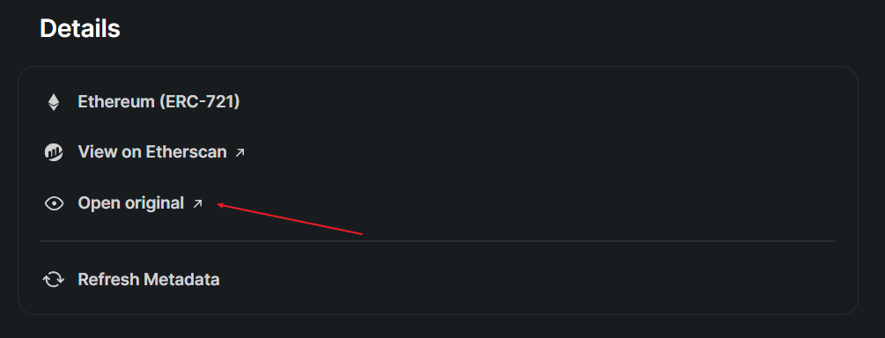

### Simple way to create a NFT (Testnet)

> Tutorial based on [How To Make and Sell an NFT in 10 Minutes](https://youtu.be/LvXi0hqXAVA?si=Kn8v9oke_rweWldi)

- Prepare a wallet (e.g. Metamask)
- Choose a testnet (e.g. Sepolia, which is a testnet for Ethereum)
- Obtain free testnet token by fauset

In this tutorial, we use [Google Cloud Faucet](https://cloud.google.com/application/web3/faucet/ethereum/sepolia).

Enter testnet address, choose Ethereum Sepolia, then get SepoliaETH🎉


- Choose testnet NFT platform [Rarible Testnet](https://testnet.rarible.com/)
- Connect wallet in the platform
- Find NFT mint page

> Create → NFT → Ethereum → Single
>
> 

- Mint a NFT

> Choose file (picture, music, video, etc.)
>
> → Put on market (❗ Important. If NFT is not put in market, the platform will only create it instead of mining it to blockchain.) (Also, if the NFT is not minted to blockchain, it will not appear in Wallet.)
>
> → Put custom price
>
> → Choose custom collection
>
> → Put name (description, properties, alternative text for NFT is optional)
>
> → Create item
>
> 

- See in the wallet (If NFT created successfully.)
- More detail

Every NFT has its own contract address and token id.

In Rarible, the info is in URL: (Format is: https://testnet.rarible.com/token/ContractAddress: Tokenid) https://testnet.rarible.com/token/0xb7755fe0680d9979ba3cd9ff13d9313a34646904:101166754884004284756004686059074315640929022204163172183028086912961031962626

We can see more detailed info in Etherscan (or other explorer). (Input format is: https://sepolia.etherscan.io/token/ContractAddress?a=Tokenid)

https://sepolia.etherscan.io/token/0xb7755fe0680d9979ba3cd9ff13d9313a34646904?a=101166754884004284756004686059074315640929022204163172183028086912961031962626



Then, click Transaction hash to get infomation page.



- Metadata

In order to get metadata from NFT. We can get the input data in transaction info page above. Click the "Decode Input Data". And find tokenURI. This is token uri where stores token metadata. Since we created the NFT by rarible, we should found the ipfs system in rarible.


In NFT detail, there is an open original link and we open it to get the original input data.



We can find the ipfs system in the URL. (i.e. https://ipfs.raribleuserdata.com/ipfs)

https://ipfs.raribleuserdata.com/ipfs/bafybeibyroxvuqtboimymus6x4oyiuthmk7pz3vrbmlrij3psa7xsvcexe/image.png

Since we get the TokenURI: /ipfs/bafkreihenhkciqnxe6irqvqtih23h2fwcf7uuigrcgwzsndwlblq4bhx5u

We combine the URI with ipfs link: https://ipfs.raribleuserdata.com/ipfs/bafkreihenhkciqnxe6irqvqtih23h2fwcf7uuigrcgwzsndwlblq4bhx5u

Here we get:

```json
{
  "name": "Moon",
  "description": "Moon Testnet Token",
  "image": "ipfs://ipfs/bafybeibyroxvuqtboimymus6x4oyiuthmk7pz3vrbmlrij3psa7xsvcexe/image.png",
  "external_url": "https://testnet.rarible.com/token/0xb7755fe0680d9979ba3cd9ff13d9313a34646904:101166754884004284756004686059074315640929022204163172183028086912961031962626",
  "attributes": []
}
```

For full moon NFT we created, we can get:

```json
{
  "name": "Full Moon",
  "description": "This is a full moon test NFT",
  "image": "ipfs://ipfs/bafybeib34thqwsx7v6v5rcwlxldy2554vvn4nby2yhrmoiumtf2ntnll3i/image.png",
  "external_url": "https://testnet.rarible.com/token/0xb7755fe0680d9979ba3cd9ff13d9313a34646904:101166754884004284756004686059074315640929022204163172183028086912961031962627",
  "attributes": [
    {
      "key": "alt_text",
      "trait_type": "alt_text",
      "value": "I love this full moon."
    }
  ]
}
```
